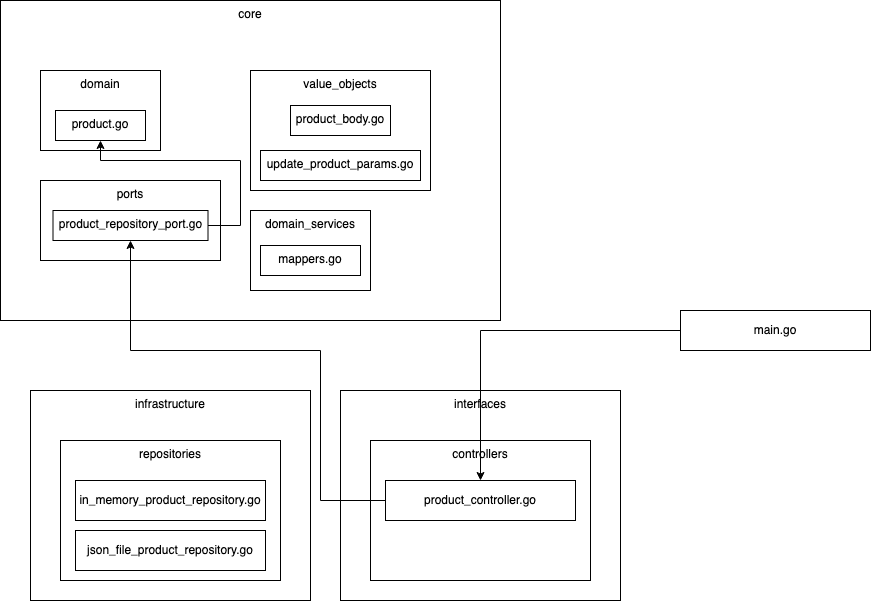

# Product Service

<figure markdown>
  
  <figcaption>Domain Driven Hexagonal Architecture</figcaption>
</figure>

You are the main dev of a big online shop.
The old product service is written in an esoteric language, which cannot handle more than 10.000 requests per second.
Now you want to try Go, so let's do this!

Create a RESTful service with the http web-framework [Gin](https://github.com/gin-gonic/gin).

It has the following endpoints:

```
GET     /product - List all articles
GET     /product/{id} - Get a specific article
POST    /product - Create a product
PUT     /product/{id} - Update a product
DELETE  /product/{id} - Delete a product
```

The product struct uses the package [https://pkg.go.dev/github.com/shopspring/decimal](https://pkg.go.dev/github.com/shopspring/decimal) for prices:

```go linenums="1" title="core/domain/product.go"
import (
	"github.com/shopspring/decimal"
)

type Product struct {
	ID       int64
	Name     string
	Category string
	Price    decimal.Decimal
}
```

The service should have two possible ways to store products and categories.
It should store all data **in memory** or in **json files** called `products.json` and `categories.json`.
Use [interfaces](../../../golang/golang-fundamentals/types_interfaces_methods.md#interfaces), [domain driven hexagonal architecture](../../../golang/architecture/index.md) and [dependency injection](../../../golang/dependency_injection/wire.md) to built the service properly.

Example Requests:

### Create products

Request:

```title="POST /products"
{
    "name": "iPhone 14 Pro",
    "price": 99.99,
    "category": "smartphones"
}
```

Response:

```title="POST /products: 200"
1
```

Request:

```title="POST /products"
{
    "name": "iPhone 12 Pro",
    "price": 999.99,
    "category": "smartphones"
}
```

Response:

```title="POST /products: 200"
2
```

Request:

```title="POST /products"
{
    "price": 999.99,
    "category": "smartphones"
}
```

Response:

```title="POST /products: 400"
{
    "error": "Key: 'ProductBody.Name' Error:Field validation for 'Name' failed on the 'required' tag"
}
```

### Get products

Request:

```title="GET /products"

```

Response:

```title="GET /products: 200"
[
    {
        "id": 1,
        "name": "iPhone 14 Pro",
        "category": "smartphones",
        "price": "99.99"
    },
    {
        "id": 2,
        "name": "iPhone 13 Pro",
        "category": "smartphones",
        "price": "999.99"
    }
]
```

### Get a specific product

Request:

```title="GET /products/1"

```

Response:

```title="GET /products/1: 200"
{
    "id": 1,
    "name": "iPhone 14 Pro",
    "category": "smartphones",
    "price": "99.99"
}
```

Request:

```title="GET /products/999"

```

Response:

```title="GET /products/999: 404"
{
    "error": "could not find product with id: 999"
}
```

### Update a product

Request:

```title="PUT /products/1"
{
    "name": "iPhone 11 Pro",
    "category": "smartphones",
    "price": "999.99"
}
```

Response:

```title="PUT /products/1: 200"
{
    "name": "iPhone 11 Pro",
    "category": "smartphones",
    "price": "999.99"
}
```

### Delete a product

Request:

```title="DELETE /products/1"

```

Response:

```title="DELETE /products/1: 204"

```
