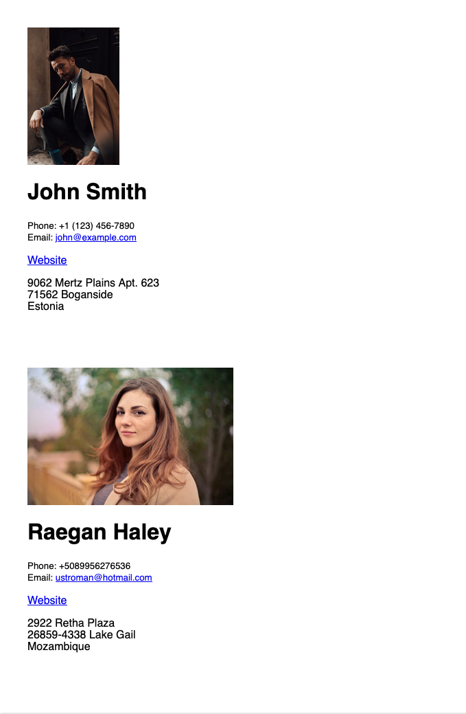

# Components / JSX

First create a React Project with `create-react-app`.

Take this user information:

```json
const users = [
    {
        "firstName": "John",
        "lastName": "Smith",
        "email": "john@example.com",
        "profilePicture": "https://images.pexels.com/photos/6206980/pexels-photo-6206980.jpeg?auto=compress&cs=tinysrgb&w=1260&h=750&dpr=1",
        "phone": "+1 (123) 456-7890",
        "address": {
            "street": "9062 Mertz Plains Apt. 623",
            "buildingNumber": "410",
            "city": "Boganside",
            "zipcode": "71562",
            "country": "Estonia"
        },
        "website": "http://www.johnsmith.com"
    },
    {
        "firstName": "Raegan",
        "lastName": "Haley",
        "email": "ustroman@hotmail.com",
        "profilePicture": "https://images.pexels.com/photos/733872/pexels-photo-733872.jpeg?auto=compress&cs=tinysrgb&w=1260&h=750&dpr=1",
        "phone": "+5089956276536",
        "address": {
            "street": "2922 Retha Plaza",
            "city": "Lake Gail",
            "zipcode": "26859-4338",
            "country": "Mozambique"
        },
        "website": "http://zboncak.biz"
    }
]
```

And create the following website with React.js by using React components.

<figure markdown>
  
</figure>
