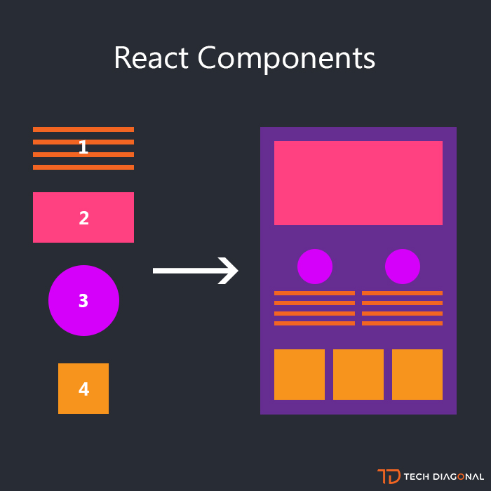

# Components

A React component is a small, reusable code, which is responsible for one part of the application UI. A React application is an aggregation of components. React can help us to build reusable components. The following diagram shows different components. All the components have different colors. In React we assemble different components together to create an application. We use JavaScript functions to make components. If we use a function, the component will be a functional component, but if we use a class, the component will be a class-based component.



## Creating React Components

Using a JavaScript function, we can make a functional React component.

A React component **has to** start with an uppercase letter!

This example is the most simple React Component you can image:

!!! example

    ```js
    function ComponentName() {
        return <p>Content</p>
    }
    ```

As we know already you can define variables and set the values in JSX:

!!! example

    ```js
    function Component() {
        const user = {
            firstName: 'Test',
            lastName: 'Tester',
        }

        return (
            <>
                <p>{user.firstName}</p>
                <p>{user.lastName}</p>
            </>
        )
    }
    ```

Also you can define styles in the Component:

!!! example

    ```js
    function Component() {
        const user = {
            firstName: 'Test',
            lastName: 'Tester',
        }
        const firstNameStyles = {
            fontSize: '24px',
        }

        const lastNameStyles = {
            fontSize: '18px',
            color: 'red',
        }

        return (
            <>
                <p style={firstNameStyles}>First Name: {user.firstName}</p>
                <p style={lastNameStyles}>{user.lastName}</p>
            </>
        )
    }
    ```

If you run the example above in Babel you get following JavaScript Code:

!!! example

    ```js
    'use strict'

    function Component() {
        const user = {
            firstName: 'Test',
            lastName: 'Tester',
        }
        const firstNameStyles = {
            fontSize: '24px',
        }
        const lastNameStyles = {
            fontSize: '18px',
            color: 'red',
        }
        return /*#__PURE__*/ React.createElement(
            React.Fragment,
            null,
            /*#__PURE__*/ React.createElement(
                'p',
                {
                    style: firstNameStyles,
                },
                'First Name: ',
                user.firstName,
            ),
            /*#__PURE__*/ React.createElement(
                'p',
                {
                    style: lastNameStyles,
                },
                user.lastName,
            ),
        )
    }
    ```

As you see, you actually call `React.createElement` and pass in the element name + the variables you defined.

The result of the example is:

!!! example

    ```html
    <p style="font-size: 24px;">First Name: Test</p>
    <p style="font-size: 18px; color: red;">Tester</p>
    ```

## Nesting React Components

Let's image you have a component, which you would like to insert into another component.
Let's see this example:

!!! example

    ```js
    function Text() {
        return <p>Some Text</p>
    }

    function Wrapper() {
        return (
            <>
                {Text()}
                {Text()}
                {Text()}
            </>
        )
    }
    ```

Because this is not the way `Components` are meant for, you can actually use React Component Functions as JSX Elements.

Components are made for sharing. Because of that, components should be nestable.
You can use React Components as JSX Elements to render them out.
Let's check a simple example first:

!!! example

    ```js
    function Text() {
        return <p>Some Text</p>
    }

    function Wrapper() {
        return (
            <>
                <Text />
                <Text />
                <Text />
            </>
        )
    }
    ```

    output:

    ```html
    <p>Some Text</p>
    <p>Some Text</p>
    <p>Some Text</p>
    ```

if you check the Babel output this is what happens:

!!! example

    ```js
    'use strict'

    function Text() {
        return /*#__PURE__*/ React.createElement('p', null, 'Some Text')
    }
    function Wrapper() {
        return /*#__PURE__*/ React.createElement(
            React.Fragment,
            null,
            /*#__PURE__*/ React.createElement(Text, null),
            /*#__PURE__*/ React.createElement(Text, null),
            /*#__PURE__*/ React.createElement(Text, null),
        )
    }
    ```

The actual function `Text` gets inserted into `React.createElement`.
