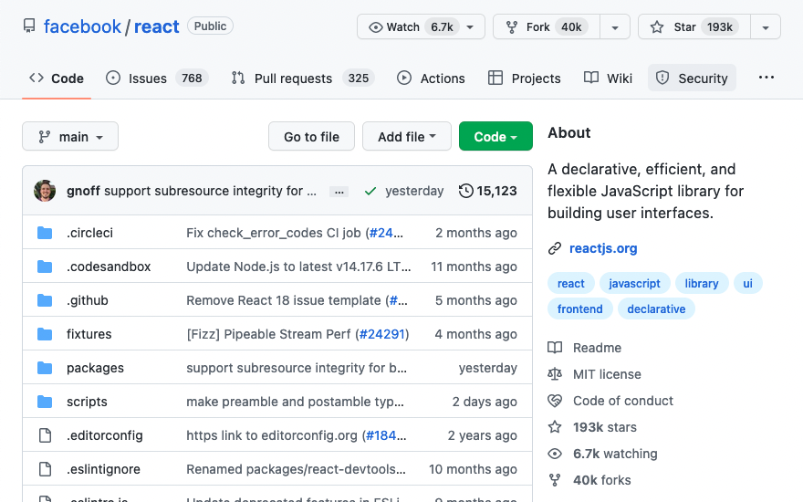
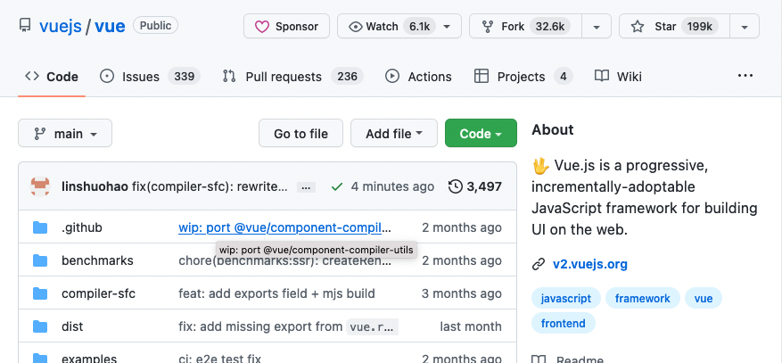
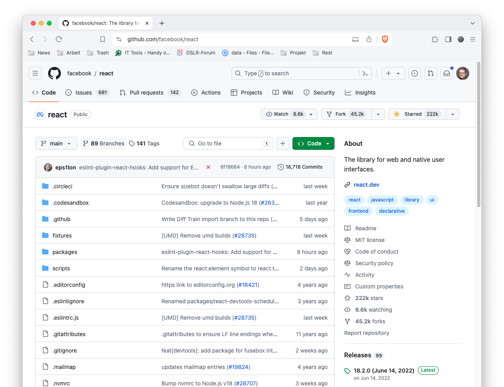

# Getting Started

This section covers prerequisites to get started with React. You should have a good understanding of the following technologies:

-   HTML
-   CSS
-   JavaScript

## What is React?

React is a JavaScript **library** for building a reusable user interface(UI). It was initially released on May 29, 2013. The current version is 18.x.x and it is stable. React was created by Facebook. React makes creating UI components very easy. The official React documentation can be found [here](https://reactjs.org/docs/getting-started.html). When we work with React we do not interact directly with the DOM. React has its own way to handle the DOM(Document Object Model) manipulation. React uses its virtual DOM to make new changes and it updates only the element, that needs changing. Do not directly interact with DOM when you build a React Application and leave the DOM manipulation job for the React virtual DOM. A web application, or a website, is made of buttons, links, forms with different input fields, header, footer, sections, articles, texts, images, audios, videos and boxes with different shapes. We use react to make a reusable UI components of a website.

To summarize:

-   React was released in May 2013
-   React was created by Facebook
-   React is a JavaScript library for building user interfaces
-   React is used to build single page applications - An application which has only one HTML page.
-   React allows us to create reusable UI components
-   React latest release is 18.x.x
-   [React versions](https://reactjs.org/versions/)
-   React official documentation can be found [here](https://reactjs.org/docs/getting-started.html)

## Why React?

React is one of the most popular JavaScript libraries. Many developers and companies have been using it for the last couple of years. Its popularity has been growing fast and it has a huge community. How do we measure popularity? One measure of popularity could be GitHub repository stars, watchers and forks. Let us compare the popularity of [React](https://github.com/facebook/react) and [Vue](https://github.com/vuejs/vue). As of today, the popularity between the two most popular JavaScript looks like as shown on the diagram. From the diagram, you can speculate the most popular JavaScript library. You may look at the number of watchers, stars and forks for both React and Vue. These alone will not be a very good measure of popularity, but still it tells a little bit about the popularity of the two technologies. If I have to recommend another JavaScript library next to React, it would be Vue.js.

### React vs Vue vs Angular popularity in October 2022

React Official GitHub Repository

Vue Official GitHub Repository

Angular Official GitHub Repository

### React vs Vue2 vs Vue3 vs Angular popularity in April 2024

React Official GitHub Repository

Vue2 Official GitHub Repository

Vue3 Official GitHub Repository

Angular Official GitHub Repository

Why we choose to use React?

-   fast
-   modular
-   scalable
-   flexible
-   big community and popular
-   open source
-   High job opportunity
-   most used JavaScript rendering library

## IDE

Which IDE should you choose?

-   [Webstorm](https://www.jetbrains.com/webstorm/)
-   [Visual Studio Code](https://code.visualstudio.com/)

Good extensions for Visual Studio Code:

-   [Prettier](https://marketplace.visualstudio.com/items?itemName=esbenp.prettier-vscode)
-   [Auto Rename Tag](https://marketplace.visualstudio.com/items?itemName=formulahendry.auto-rename-tag)
-   [npm Intellisense](https://marketplace.visualstudio.com/items?itemName=christian-kohler.npm-intellisense)
-   [Path Intellisense](https://marketplace.visualstudio.com/items?itemName=christian-kohler.path-intellisense)
