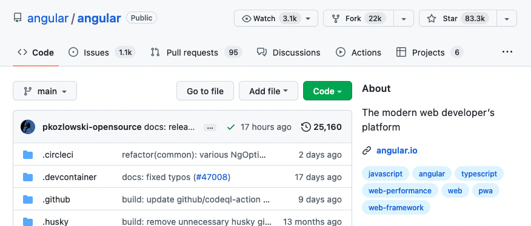

# Getting Started

This section covers prerequisites to get started with React. You should have a good understanding of the following technologies:

-   HTML
-   CSS
-   JavaScript

If you have the skills mentioned above, you will enjoy doing React. The 30 Days Of React challenge contains everything you need to know about react. In every section, it has some exercises and mini-projects, and it is recommended to work on them. This 30 Days Of React challenge will help you learn the latest version of React and the old version, step by step. The topics are broken down into 30 days, where each day contains several topics with easy-to-understand explanations, real-world examples and many hands-on exercises.
This challenge is designed for beginners and professionals who want to build a web application using React and JavaScript.
Once in a while you may need different dummy data to work with React. You can use the following [dummy data generator](https://www.30daysofreact.com/dummy-data) to generate different data.

## What is React?

React is a JavaScript library for building a reusable user interface(UI). It was initially released on May 29, 2013. The current version is 18.x.x and it is stable. React was created by Facebook. React makes creating UI components very easy. The official React documentation can be found [here](https://reactjs.org/docs/getting-started.html). When we work with React we do not interact directly with the DOM. React has its own way to handle the DOM(Document Object Model) manipulation. React uses its virtual DOM to make new changes and it updates only the element, that needs changing. Do not directly interact with DOM when you build a React Application and leave the DOM manipulation job for the React virtual DOM. A web application, or a website, is made of buttons, links, forms with different input fields, header, footer, sections, articles, texts, images, audios, videos and boxes with different shapes. We use react to make a reusable UI components of a website.

To summarize:

-   React was released in May 2013
-   React was created by Facebook
-   React is a JavaScript library for building user interfaces
-   React is used to build single page applications - An application which has only one HTML page.
-   React allows us to create reusable UI components
-   React latest release is 18.x.x
-   [React versions](https://reactjs.org/versions/)
-   React official documentation can be found [here](https://reactjs.org/docs/getting-started.html)

## Why React?

React is one of the most popular JavaScript libraries. Many developers and companies have been using it for the last couple of years. Its popularity has been growing fast and it has a huge community. How do we measure popularity? One measure of popularity could be GitHub repository stars, watchers and forks. Let us compare the popularity of [React](https://github.com/facebook/react) and [Vue](https://github.com/vuejs/vue). As of today, the popularity between the two most popular JavaScript looks like as shown on the diagram. From the diagram, you can speculate the most popular JavaScript library. You may look at the number of watchers, stars and forks for both React and Vue. These alone will not be a very good measure of popularity, but still it tells a little bit about the popularity of the two technologies. If I have to recommend another JavaScript library next to React, it would be Vue.js.

### React vs Vue vs Angular popularity in October 2022

React Official GitHub Repository


Vue Official GitHub Repository


Angular Official GitHub Repository



Why we choose to use React ? We use it because of the following reasons:

-   fast
-   modular
-   scalable
-   flexible
-   big community and popular
-   open source
-   High job opportunity

## JSX

JSX stands for JavaScript XML. JSX allows us to write HTML elements with JavaScript code. An HTML element has an opening and closing tags, content, and attribute in the opening tag. However, some HTML elements may not have content and a closing tag - they are self closing elements. To create HTML elements in React we do not use the `createElement()` instead we just use JSX elements. Therefore, JSX makes it easier to write and add HTML elements in React. JSX will be converted to JavaScript on browser using a transpiler - [babel.js](https://babeljs.io/). Babel is a library which transpiles JSX to pure JavaScript and latest JavaScript to older version. See the JSX code below.

In conclusion with Babel this:

```jsx
const a = <h1 id="123">test</h1>
```

becomes this:

```jsx
'use strict'

const a = /*#__PURE__*/ React.createElement(
    'h1',
    {
        id: '123',
    },
    'test',
)
```

JSX is **stricter** than html.
If you write for example `<br>` in HTML this becomes valid.
If you write the same in JSX, it will throw an error.

Therefore you have to close every element properly:

```jsx
<br />
```

## Expressions in JSX

If you work with JSX, you can use expressions to inject values into jsx code:

```jsx
const value = 123
const element = <p>{value}</p>
```

[Expressions](https://developer.mozilla.org/en-US/docs/Web/JavaScript/Guide/Expressions_and_Operators#Expressions) produce **values**.
According to MDN an expression is:

```
An expression is any valid unit of code that resolves to a value.
```

Do not confuse it with statements which produce code statements, assignments and expressions.

| Statements                                    | Expressions       |
| --------------------------------------------- | ----------------- |
| `let a = 1 + 2`                               | `1 + 2`           |
| `if (1 === 2) { return 3 } else { return 4 }` | `1 === 2 ? 3 : 4` |

For example, you can also use the result of a function inside of jsx:

```jsx
function formatName(user) {
    return `${user.firstName} ${user.lastName}`
}

const user = {
    firstName: 'Test',
    lastName: 'Tester',
}

const element = <h1>Hello, {formatName(user)}! </h1>
```

## Attributes in JSX

You can specify attributes in JSX:

```jsx
const h1Id = 'testId'
const element = <h1 id={h1Id}>Test</h1>
```

!!! warning

    Since JSX is closer to JavaScript than to HTML, React DOM uses camelCase property naming convention instead of HTML attribute names.

    For example, class becomes className in JSX, and tabindex becomes tabIndex.

## Children in JSX

We discussed simple elements for now.
But when HTML elements can have children, JSX elements can have them too:

```jsx
const container = (
    <div>
        <h1>Hello World</h1>
        <p>Some text</p>
    </div>
)
```

!!! warning

    Do not use nested elements without paranthesis.

    This is a **false** example:

    ```jsx
    const container =
        <div>
            <h1>Hello World</h1>
            <p>Some text</p>
        </div>

    ```

Note that you cannot use multiple elements as JSX:

```jsx
// this won't work!
const container = (
  <h1>Hello World</h1>
  <p>Some text</p>
)
```

You have to wrap multiple elements into an outer element.
This can be another html element or the 'empty' element `<>...</>`

For example:

```jsx
const container = (
    <div>
        <h1>Hello World</h1>
        <p>Some text</p>
    </div>
)

const container = (
    <>
        <h1>Hello World</h1>
        <p>Some text</p>
    </>
)
```

## Adding styles

If you want to add a style to a JSX element, you can use `className` (instead of the html `class`) or `style`.
Please note, that `style` will be overwritten by Babel so that you cannot use just a string, but you use an object:

```jsx
const container = <p style={{ color: 'red', fontSize: ''}}>abc</p>
```
